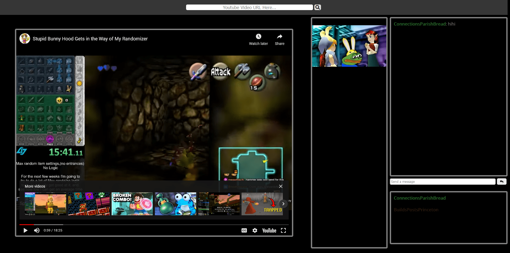

# Quadrate
KISS Youtube Video Syncing

# Building

## Requirements
Quadrate only requires [golang](https://go.dev/) to run.

## Windows / Linux / MacOS
Inside our index.html file we need to change the websocket path to our webserver
```javascript
let socket = new WebSocket("ws://public_ip:port/ws");
```
And inside our quadrate.go file we need to change our listening address and proxy address
```go
r.SetTrustedProxies([]string{"local_ip"})
r.Run("local_ip:port")
```
In order to run quadrate simply execute
```bash
go run .
```
from inside the root of the project

Afterwords you should be able to access Quadrate from the url
```
http://public_ip:port/
```

# Screenshot
